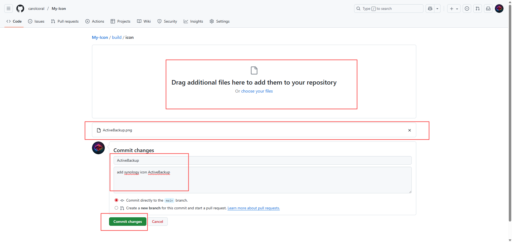
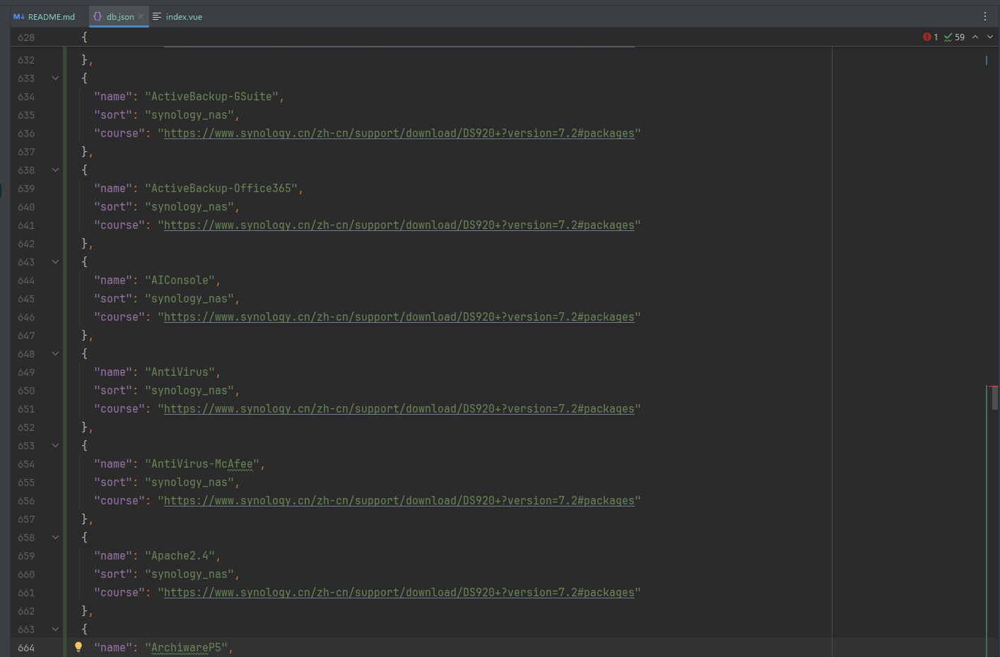

# My Icon

#### 介绍
提供在线图标链接，用于个人NAS设备显示使用，禁止用于商业用途

#### 使用
点击相应图标即可获取URL

#### 分类
Docker容器（docker）
VMS虚拟机（vms）
其他（other）

#### Docker部署
- Docker部署nginx服务
- 下载dist文件夹
- 放到nginx的www文件夹中
- 将图标放入icon文件夹
- 修改db.json

## 添加图标
> 欢迎PR新的图标到仓库中，以下介绍图标的添加方法

> 添加完成后，等待管理员进行合并（基本上周期最多在一周内），合并后仓库会自动构建发布

> 目前提供公益的访问地址 [XIN·DU ICON](https://icon.xindu.site)

### 操作步骤
1. 上传图标（png格式）放到icon文件夹中
   
2. 点击编辑db.json文件
   
3. 仿照下面的格式修改即可
    > 新增分类需要修改页面代码中对应部分
   * name(图标名称)：一定要和图标命名保持一致 
   * sort(分类)：docker,vms,synology_nas,other 
   * course(教程链接)：这个设置为空就行

