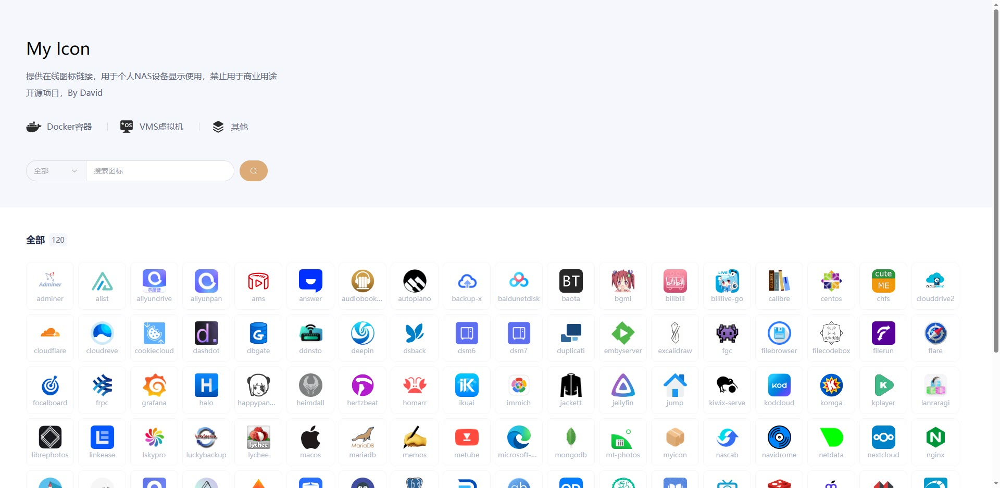

# My Icon

#### 介绍
提供在线图标链接，用于个人NAS设备显示使用，禁止用于商业用途

#### 使用
点击相应图标即可获取URL

#### 分类
Docker容器（docker）
VMS虚拟机（vms）
其他（other）

#### Docker部署
- Docker部署nginx服务
- 下载dist文件夹
- 放到nginx的www文件夹中
- 将图标放入icon文件夹
- 修改db.json

